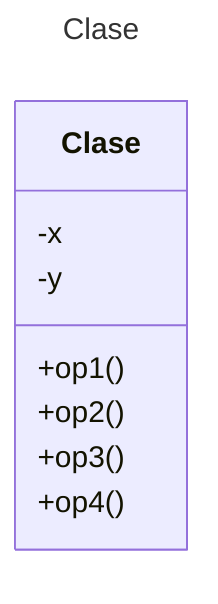

# Proyecto Java POS con Maven

Este proyecto implementa un mini sistema de Punto de Venta (POS) desarrollado en Java utilizando Maven como herramienta de gestión de dependencias y construcción.

## Diagrama de Clases

Puedes editar y visualizar el siguiente diagrama utilizando el [Editor en línea de Mermaid](https://mermaid.live/).


**Referencia:** [Sintaxis de Diagramas de Clases en Mermaid](https://mermaid.js.org/syntax/classDiagram.html)

## Diagrama de Clases UML con Draw.io

El repositorio está configurado para crear diagramas de clases UML utilizando **Draw.io**. 

### Instrucciones de uso:
1. Agrega un archivo con extensión `.drawio.png` al repositorio
2. Haz doble clic sobre el archivo para activar el editor Draw.io integrado en VS Code
3. Asegúrate de agregar las formas UML desde el menú de formas del lado izquierdo (selecciona la opción **+Más formas**)

## Generación de Diagramas UML con AppMap

### Uso en GitHub Codespaces:

Ejecuta el siguiente comando para generar los diagramas:
```bash
mvn com.appland:appmap-maven-plugin:prepare-agent test
```
Posteriormente, haz clic en el archivo `tmp/appmap/junit/miPrincipal_AppTest_testingList.appmap.json` para visualizar el diagrama de secuencia generado.

### Uso en VS Code Local:

1. Ejecuta las pruebas locales desde VS Code
2. Haz clic en el archivo `tmp/appmap/junit/miPrincipal_AppTest_testingList.appmap.json` para visualizar el diagrama de secuencia

## Generación de Diagramas UML usando Navie Chat (IA de AppMap)

### Prompts para generar diagramas de clases y secuencia:

Utiliza los siguientes prompts para generar los diagramas. Una vez generado, puedes visualizarlo en [Mermaid Live](https://mermaid.live/) y copiar el código para documentarlo en este archivo README.md.

```text
@diagram Genera un Diagrama de clases para el paquete `miPrincipal` 
@diagram Genera un Diagrama de secuencia para el paquete `miPrincipal`
```

### Explicación del proyecto usando Navie Chat:

**Prompt para obtener una explicación del proyecto:**

```text
@explain la programación de este proyecto
Explica la programación de este proyecto
```

## Uso del Proyecto con Maven

### Compilar el proyecto:
```bash
mvn compile
```

### Ejecutar todas las pruebas:
```bash
mvn test
```

### Ejecutar una prueba específica:
```bash
mvn test -Dtest="AppTest#testPOS" 
```

### Ejecutar la aplicación:

**Opción 1:** Usando Maven:
```bash
mvn -q exec:java
```

**Opción 2:** Usando Java directamente:
```bash
java -cp target/classes miPrincipal.App
```

### Empaquetar la aplicación:
```bash
mvn package
```

### Limpiar archivos compilados:
```bash
mvn clean
```

## Control de Versiones con Git

### Registrar cambios localmente:

Por cada cambio importante que realices, actualiza el historial del repositorio con los siguientes comandos:

```bash
git add .
git commit -m "Descripción del cambio"
```

### Enviar cambios a GitHub:

Para sincronizar tus cambios con GitHub y activar el proceso de Autograding, ejecuta:

```bash
git push origin main
```

---

**Nota:** Los comandos anteriores están diseñados para un ambiente Linux. Para más información, consulta la [referencia de JUnit desde línea de comandos](https://www.baeldung.com/junit-run-from-command-line).
